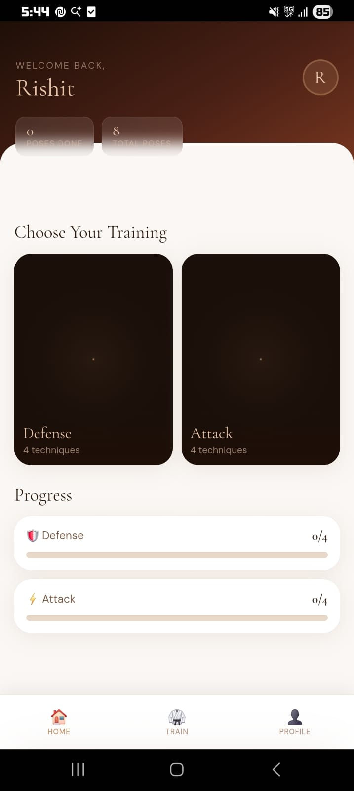

# Raksha

AI-powered self defense training for everyone

## Live Website

[Visit Website](https://rakshaapp.github.io)

## Overview

Raksha aims to make physical self-defense training accessible to everyone through AI-powered pose detection and audiovisual feedback. 

## Features

- Pose detection using MediaPipe
- Audio feedback based on accuracy
- Video integration for learning

## Technologies

- HTML
- CSS
- JavaScript
- MediaPipe
- Supabase

## Screenshots

## Future Improvements

- Needs accuracy improvement
- Better UI and UX

## Status

Work in Progress

---

Created by [rishitc17](https://github.com/rishitc17)
